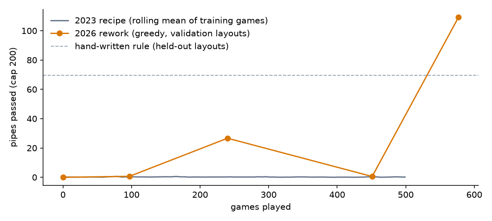

# flappy bird AI: deep Q-learning, take two

a from-scratch flappy bird clone, and an agent that learns to play it with deep Q-learning (PyTorch).

**watch it learn, or race it, in your browser:** https://portfolio-ahl.pages.dev/college/game-ais

## the short version

i built this in 2023, watched it clear the odd lucky pipe, and very confidently wrote in this README that it had started to learn.

it hadn't. in 2026 i dusted it off to put it on my portfolio, re-ran that exact recipe on the same game, and it averaged 0.15 pipes. so before it could go on the portfolio, it had to actually work.

both versions live in this repo. the comparison below is measured on the same game, from one training run of each.

## results

| | mean pipes | best | training games |
|---|---|---|---|
| 2023 recipe (re-run) | 0.15 | 2 | 500 |
| hand-written rule | 69.5 | 200 | n/a |
| 2026 rework | 85.9 | 200 | 577 |

evaluated greedily on 100 held-out pipe layouts (seeds 2000–2099), capped at 200 pipes. checkpoints were picked on a separate 20 (seeds 1000–1019), so selection doesn't flatter these numbers.

the hand-written rule flaps whenever the bird sinks within 40px of the bottom of the next gap. the agent beats it. i'll take it.

## what the agent sees

seven numbers per frame, scaled to roughly −1 to 1:

- distance from the bird to the top and bottom of the next gap
- the same for the gap after it
- horizontal distance to the next pipe
- vertical speed
- height

two actions: flap or don't.

seeing the gap after next made the biggest difference in my experiments, and it's the one i least expected. consecutive gaps can be 350px apart with only 40 frames to get there, so you have to start moving before you've cleared the current pipe.

## why the 2023 version never learned

these are the bugs i found reading the code back. i didn't test them one at a time, so i can't tell you which one did the real damage. any of them could have.

- **raw pixel inputs** (values in the hundreds) with a learning rate of 0.05, which i think saturated the network. that's the stuck-on-one-action collapse 2023 me blamed on exploding gradients.
- **rewards out of scale.** −1000 for dying, +10 for a pipe, and with γ = 0.9 a pipe 40 frames away is worth 0.9⁴⁰ ≈ 1.5% of its value. the agent could barely see the thing it was supposed to want.
- **a safety override recorded the wrong action.** near the floor and ceiling the game took over, but replay memory stored the move the agent *chose*, not the one that happened. so it was learning from moves it never made.
- **exploration switched off after 80 games.**
- **the TD target wasn't detached,** so every update also pushed the target around.
- **one-sample-at-a-time training,** which made every update noisy and slow.

## what changed when i dusted it off

- normalised, bird-relative inputs, including the gap after next
- rewards of +0.1 per frame, +1 per pipe, −1 per crash, with γ = 0.99
- double DQN with a target network
- huber loss and gradient clipping (which, fun fact, the 2023 README proposed as the fix and then never tried)
- mini-batches from a 100k replay buffer
- no safety override. it keeps itself alive now.
- keep the best checkpoint by validation score, not the last one. DQN on this task swings between brilliant and hopeless, and most of the later checkpoints in the run fell apart again.

## run it

    uv run pytest                                  # tests
    uv run python train.py --steps 300000          # train (CPU, minutes)
    uv run python baseline_2023.py                 # re-run the 2023 recipe
    uv run python export_web.py                    # export to the portfolio
    uv run python human_game.py                    # play it yourself

## repo layout

- `flappy_env.py`: the headless game. source of truth, the browser port mirrors it.
- `train.py`: the DQN.
- `baseline_2023.py`: the old recipe, re-run on the new game.
- `export_web.py`: exports the agent to the portfolio.
- `legacy/`: the original 2023 code and charts, kept for the record.
